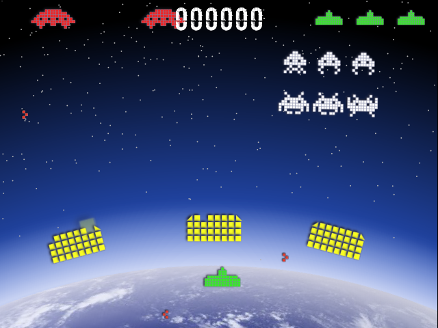
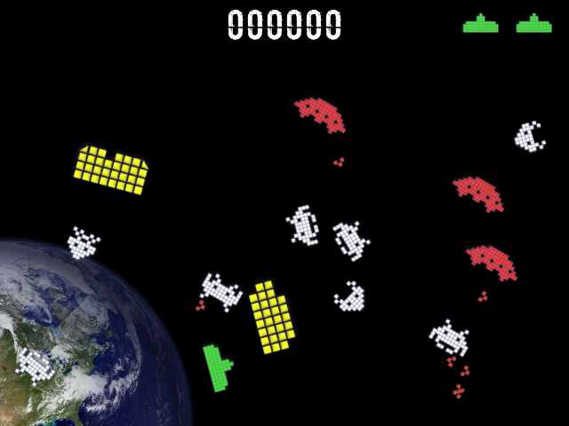
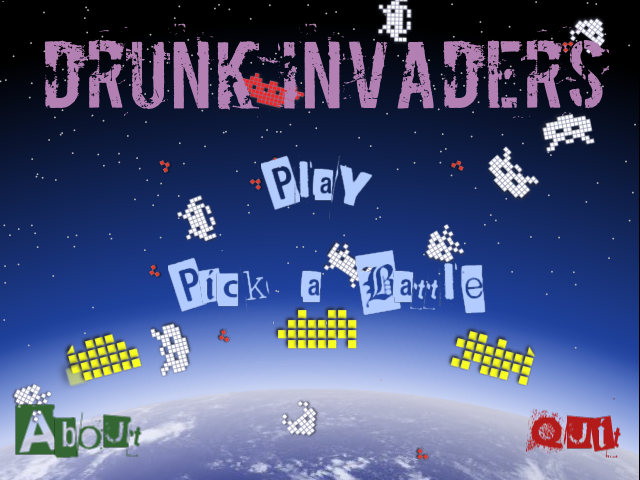

# Drunk Invaders

A new take, on an ancient classic.

The invasion looks familiar; squadrons of aliens in tight formation.

But hang on, they appear to be completely pissed.

Knocking into each other, bouncing around like ping pong ball.

Not surprisingly, this break from formation makes them all the harder to hit.
(Why did the invaders of yesteryear just wait to be picked off so easily?)

Take the fight from Earth, to the Moon, and finally to Mars.

## Screenshots

It all looks fairly standard, but ...

It gets weird!

## Install

To play, you must first install [Tickle](https://github.com/nickthecoder/tickle).

## Status

The game is playable, but needs some more level before I'd call it finished.

## About

This is the first game written in Groovy using the Tickle Game Engine.
Hopefully, it should be relatively easy to understand the code, and therefore
makes a good introduction to the Tickle game engine.

Powered by [Tickle](https://github.com/nickthecoder/tickle) and [LWJGL](https://www.lwjgl.org/).
